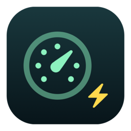

<p align="center"></p>

# MinMacs

Reclaim your Mac for developers and agents. A free menu bar app that shows exactly what is burning CPU and memory, quits the apps that do nothing for your work, trims the noise tabs out of your browser while keeping the browser, and leaves alone anything an agent is using. One click, with a Restore button. Made for MacBooks that run Claude Code, builds, and long agent sessions next to a browser with a hundred tabs.

Part of a family: [Insomnia](https://github.com/FRIKKern/insomnia) keeps the Mac awake, [noo-noo](https://github.com/FRIKKern/noo-noo) keeps the disk clean, MinMacs keeps the CPU and RAM for what matters.

## The rules

1. **Nothing is closed that wasn't shown first.** The menu is the plan. "Will close (4)" lists each app with its CPU and memory before you press anything.
2. **Only apps on an explicit close list get closed.** Developer and agent essentials, such as terminals, editors, Docker, databases, Claude, Insomnia and noo-noo, are on a keep list and never even offered. Anything unknown is listed as unsorted and never touched until you sort it, one click, remembered.
3. **Graceful first, force when you say so.** Every app gets a normal Quit and eight seconds to act on it. What happens to one that refuses is your setting: ask me, force quit it, or leave it running. **Restore** relaunches the apps and reopens the tabs MinMacs closed.
4. **Browsers are trimmed, not quit.** Tabs on your noise list close; everything else, and the browser itself, stays. Agents that use the browser keep their session.
5. **An app in use by an agent is spared**, and the menu says why.

## Install

```sh
curl -fsSL https://raw.githubusercontent.com/FRIKKern/minmacs/main/install.sh | sh
```

Builds from source in a few seconds with Apple's Command Line Tools, so there is no Gatekeeper prompt. Installs `~/Applications/MinMacs.app` and a `minmacs` command in `~/.local/bin`. Or `brew install frikkern/tap/minmacs`, or the zip on the [latest release](https://github.com/FRIKKern/minmacs/releases/latest) (needs a right-click → Open once).

Options through the pipe: `MINMACS_LOGIN=1` registers Launch at Login, `MINMACS_NO_LAUNCH=1` installs only, `MINMACS_REF=v1.0.0` pins a tag. Uninstall with `curl -fsSL https://raw.githubusercontent.com/FRIKKern/minmacs/main/uninstall.sh | sh`.

Requirements: macOS 13 or newer, Apple Silicon or Intel.

## Use

Click the gauge in the menu bar:

```
41 apps · system load 63% · thermal nominal
──
⚡ MinMacs Now: close 2 apps (21% CPU · 9.4 GB)
   Restore 2 closed apps
──
Will close (2)
   Google Chrome      21% · 8.7 GB    ▸ Close on MinMacs / Keep / Unsorted / Quit Now
   Spotify             1% · 578 MB
Unsorted, not touched (3)
   FigmaAgent          0% · 13 MB     ▸ …
Kept, essentials (4)                  ▸ cmux 44% · 6.8 GB, Finder, Insomnia …
Background load (system, informational) ▸ top processes not owned by any app
──
✓ Ask Before Closing
✓ Also Turn On Insomnia
  Edit Rules…
  Launch at Login
──
  Quit MinMacs
```

- **MinMacs Now** shows a confirmation listing exactly what will quit, which tabs will close, and what is spared and why, with a "Don't ask again" box.
- **When an App Won't Quit** decides the escalation. *Ask Me* (default) shows which apps refused and offers Force Quit. *Force Quit It* does so automatically after the eight seconds. *Leave It Running* never forces. Force quitting discards unsaved changes, and the dialogs say so.
- **Every app row has a submenu** to move it between Close, Keep and Unsorted, or to quit just that one. Choices are saved to the rules file.
- **Helpers roll up.** Chrome's forty helper processes count as Chrome. The numbers match what you feel, not what `ps` prints.
- **Also Turn On Insomnia** switches Insomnia on when you MinMacs, if it is installed, so the freed machine also stays awake for the job.

### Browsers: trim, don't quit

A browser is a container. Quitting it to get rid of a few video tabs also takes out your dashboards, docs and consoles. So for Chrome, Brave, Edge, Vivaldi, Opera, Chromium and Safari, MinMacs closes only tabs whose host is on the **noise** list and never closes a tab on the **work** list. Any other tab is left alone. The browser's row in the menu lists the exact tabs that will close; picking one adds its site to the work list instead. Restore reopens closed tabs.

- Private and incognito windows are never read or touched.
- Tabs are addressed in one specific browser process, so a second instance started by Playwright or with remote debugging is never affected.
- A tab that navigated somewhere else since the plan was shown is skipped.
- The first use asks for macOS Automation permission for that browser. Without it the browser is simply left running.
- Arc and Firefox do not expose tabs in a way MinMacs can read. They are left running.
- *Browsers ▸ Quit Browsers* switches to quitting them like any other app.

### Spared: apps that are serving an agent

A close-list app is left alone when it is demonstrably in use by a tool:

- it was started with a remote debugging port or pipe, which is how DevTools MCP, Puppeteer and Playwright drive a browser, or
- one of its processes listens on a **loopback** TCP port, which is how Blender's and Godot's MCP bridges and similar tools work.

The menu shows the reason, for example "serving on 127.0.0.1:9876". Listeners on all interfaces are ignored, since that is LAN discovery, not an agent. A few apps listen on loopback for their own reasons, such as Discord and Spotify, and ship on an `ignoreServing` list. *Close Even When Serving* in an app's submenu adds any other.

### Blocked: an agent that is waiting on you

Process signals can tell that an agent is working, not that it is stuck on a question only you can answer. cmux (the terminal, bundle id `com.cmuxterm.app`) records exactly that, and MinMacs can read it. It is **off by default**: turn on *Agents ▸ Read cmux for Waiting State*, or pass `--cmux` to `minmacs agents` for one run. It reads nothing unless cmux is running.

An agent that waits for a permission, an answer or a plan approval shows as **blocked** (a ◆ in the menu, `blocked` in the CLI) with its reason. A blocked agent counts as live, so MinMacs never quits anything it started.

Exactly what is read, from exactly two files, with a scanner that steps over every other value without copying it:

| File | Fields read |
|---|---|
| `~/.cmuxterm/claude-hook-sessions.json` | `pid`, `sessionId`, `surfaceId`, `workspaceId`, `updatedAt` |
| `~/.cmuxterm/workstream.jsonl` (only the last 2 MB, never the whole file) | `kind`, `createdAt`, `workstreamId` |

**Payloads are never read.** The workstream log also holds your prompts, tool inputs, titles and context; those keys, and every other key in both files, are skipped, never stored, never logged, never printed. The tail buffer is wiped after parsing. Nothing is written to either file. The two files are matched by session id and process id, and an event older than the process it names is ignored, so a reused pid cannot inherit a stale block.

How the last event decides: a permission request, question, plan approval or notification in the middle of a turn means blocked; a prompt or tool event means working, but only if it is under 60 seconds old; a stop says nothing (cmux repeats it while an agent works), so process signals decide. A notification right after a stop is the idle prompt, not a block.

### Rules file

`~/Library/Application Support/MinMacs/rules.json`, written with sensible defaults on first run and editable by hand (*Edit Rules…* opens it). Bundle ids take a trailing `*` to match a prefix. A host matches its subdomains. Work wins over noise. New defaults arrive with upgrades additively and never move or remove an entry of yours.

```json
{ "keep":  ["com.apple.Terminal", "com.microsoft.VSCode", "com.jetbrains.*", "no.guerrilla.insomnia", "…"],
  "close": ["com.google.Chrome", "com.spotify.client", "us.zoom.xos", "com.adobe.*", "…"],
  "tabs":  { "noise": ["youtube.com", "netflix.com", "reddit.com", "…"],
             "work":  ["localhost", "github.com", "claude.ai", "vercel.app", "…"] },
  "ignoreServing": ["com.hnc.Discord", "com.spotify.client", "…"] }
```

Defaults keep terminals, editors and IDEs, AI apps, containers and databases, password managers and a few utilities. Defaults close browsers, media, communication, creative suites, office apps, games and stores. Everything else is unsorted.

## CLI and agents

The same binary is a command line tool. Nothing here needs the menu bar app to be running.

```sh
minmacs plan                     # what would be quit, trimmed, spared, kept; plus unsorted apps
minmacs plan --json              # the same as JSON, for agents
minmacs run                      # quit the close list and trim browsers, asks y/N first
minmacs run --yes                # no prompt; apps that ignore Quit are left running
minmacs run --yes --force        # …and force quit the ones that ignore it
minmacs run --yes --only com.spotify.client
minmacs trim --yes               # only trim browser tabs
minmacs trim --yes --only-host youtube.com
minmacs restore                  # relaunch apps and reopen tabs, in the background
minmacs classify https://…       # noise, work or other
minmacs rules                    # print the rules file path
minmacs agents                   # agent sessions and whether each is working, idle or blocked
minmacs agents --cmux            # …and read cmux for agents waiting on you (see Blocked)
```

Exit codes: 0 done, 1 aborted, 2 usage, 3 some apps are still running. Without `--force` that means they ignored Quit, usually because they are asking to save.

The menu bar app also answers a URL scheme: `open minmacs://run` (with confirmation), `minmacs://run-now` (without), `minmacs://restore`, `minmacs://login-on`, `minmacs://login-off`, `minmacs://quit`.

**For an agent** preparing a Mac for a long job:

```sh
minmacs plan --json | jq '.close[] | .name'      # tell the user what will go
minmacs run --yes --force                        # then do it, no stragglers
open insomnia://on                               # keep the Mac awake for the run
```

## How it works

Every four seconds MinMacs samples all processes through `libproc`, computes CPU as the change in CPU time over wall time, reads physical memory footprint, and attributes each process to the app macOS holds responsible for it, the same grouping Activity Monitor uses, with a parent-chain fallback. The app itself idles at 0% CPU and about 15 MB. Objective-C files only, no dependencies, builds with clang alone.

## Build from a checkout

```sh
git clone https://github.com/FRIKKern/minmacs.git && cd minmacs
./build.sh                 # universal build, installs app and CLI link
./build.sh --no-install
```

See [CHANGELOG.md](CHANGELOG.md) and, for AI agents working on the code, [AGENTS.md](AGENTS.md).

## Limits

- Force quitting discards unsaved changes. That is what the setting is for, and why the default asks first.
- MinMacs cannot see whether a tab is playing media, only which site it is on. The noise list covers the usual sources.
- Closing a tab drops what it was doing. Restore reopens the page; a half-written form does not come back.
- macOS system processes are shown for information but never touched. If Spotlight or Photos analysis is eating CPU, MinMacs tells you, it cannot stop them.
- Not notarised. Building locally sidesteps Gatekeeper; the release zip needs a right-click → Open once.

## License

MIT. Made by [Frikk Jarl](https://github.com/FRIKKern).
